# Research Agent

A local tool for structured research. You give it a natural-language prompt like "find coworking spaces in Cape Town near Sea Point with a gym, coffee, and month-to-month contracts" and it:

1. Parses the prompt into hard/soft requirements with types and weights
2. Runs 5-10 parallel web searches to find candidates
3. Deduplicates with an LLM pass (same venue, different listing)
4. Deep-researches each candidate's official website, pricing pages, review sites
5. Fills in every requirement with a value, source URL, and explanatory note
6. Gets real drive times from Google Maps
7. Scores and ranks everything

All data goes into SQLite. The frontend is a dense, Tufte-inspired split view.

## What it looks like

Start a research project from the home page. Each project tracks its status and cost.

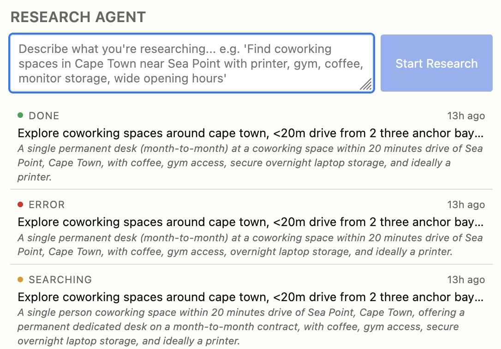

Results come back as a split view. The left sidebar shows all found options with scores and key stats as pill boxes. Selecting a listing opens the full detail on the right.

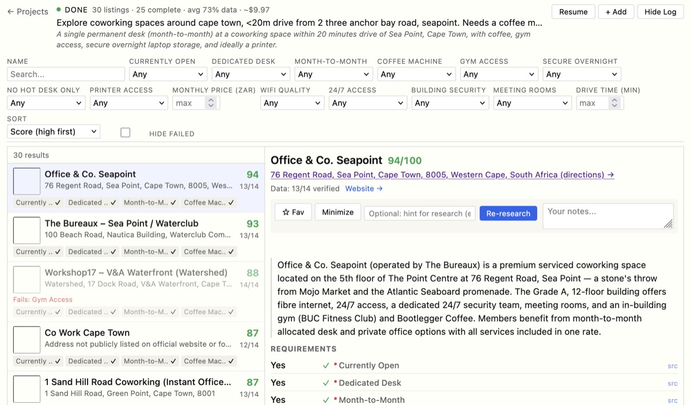

The sidebar shows scores, data completeness, and the first few requirements at a glance:

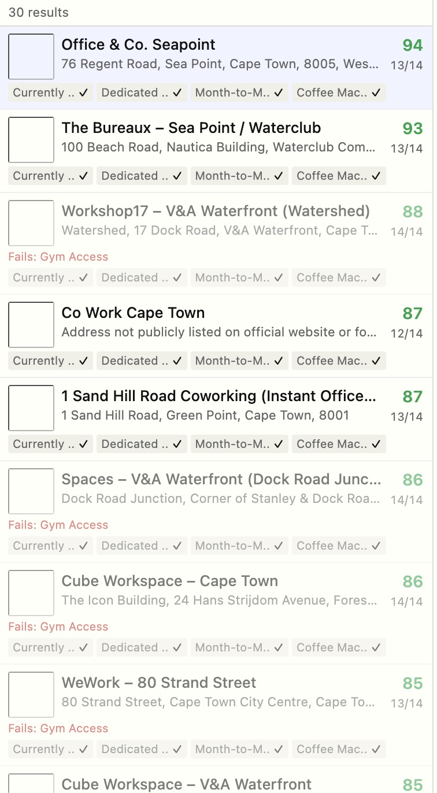

### Filters

Filters are generated from the requirements. Bool filters default to "Yes + Unknown" so you don't lose listings just because data is missing. Sort by any attribute, search by name, hide hard-requirement failures.

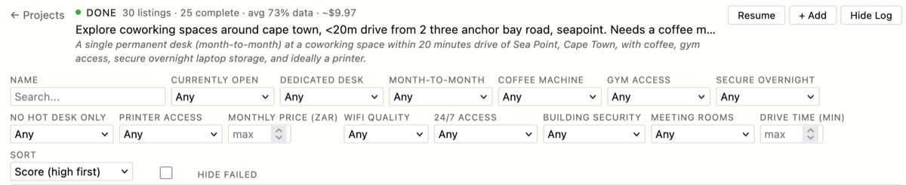

### Detail view

The detail pane shows the full breakdown. Each requirement has its value left-aligned for quick scanning, with histograms for numeric attributes showing distribution and where the current listing falls.

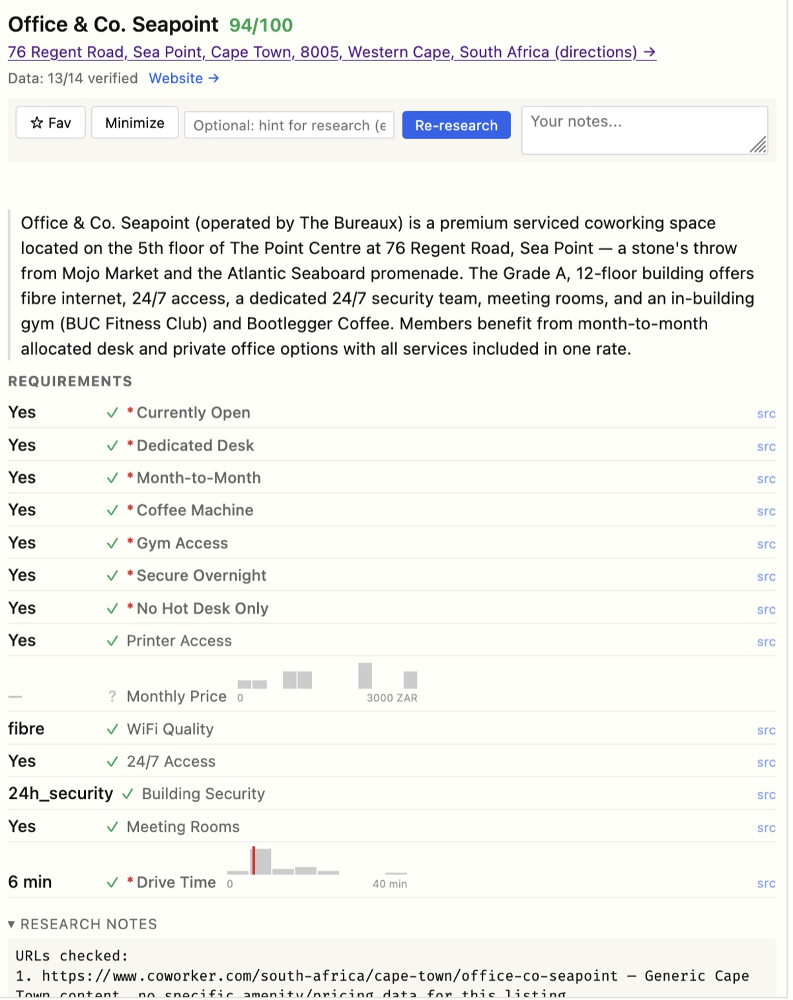

The requirements section with values, check marks, and histograms:

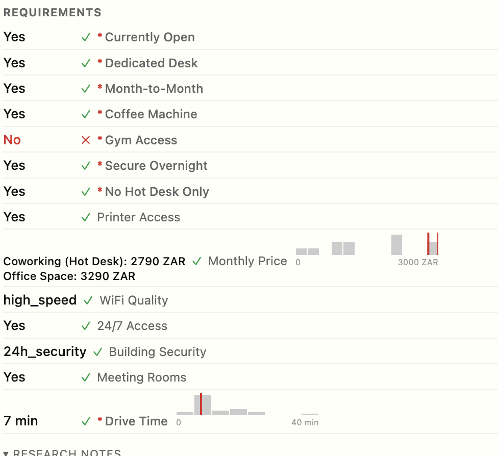

Hover a histogram bar to see the count and range for that bin:

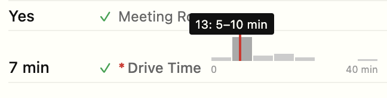

Hover a requirement label to see Claude's research note explaining how it determined the value and where it found the data:

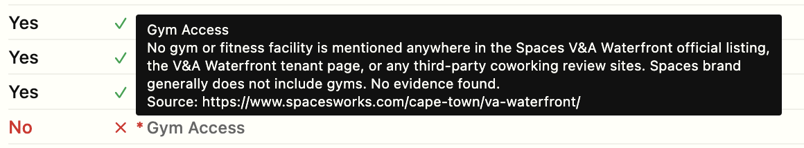

### Favourites, notes, and triage

Mark listings as favourites (gold highlight) or minimize them (greyed out) to triage your results. Add free-form notes -- the first line shows in the sidebar.

| Favourited | Minimized |
|---|---|
| 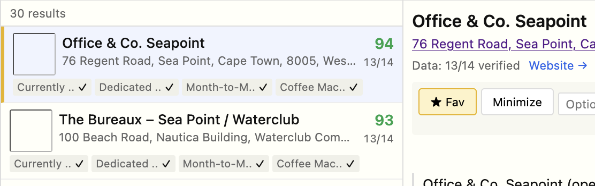 | 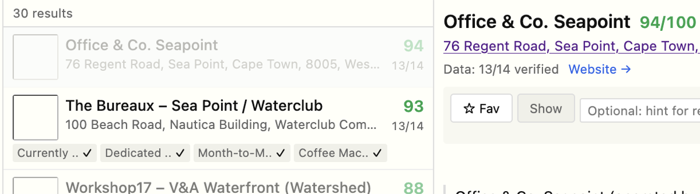 |

User notes appear in blue in the sidebar:

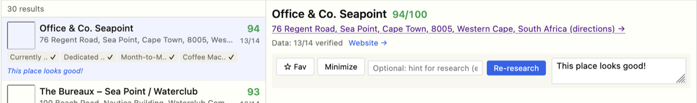

## Getting started

You need Python 3.13+, Node 20+, and [`uv`](https://docs.astral.sh/uv/).

```
git clone https://github.com/beyarkay/research-agent.git
cd research-agent

# Backend
cd backend && uv sync && cd ..

# Frontend
cd frontend && npm install && cd ..

# API keys
cat > .env << 'EOF'
ANTHROPIC_API_KEY=sk-ant-...
GOOGLE_MAPS_API_KEY=...  # optional, for real drive times
EOF

# Build and run
./scripts/dev.sh
```

Opens at `http://127.0.0.1:8000`. Type a research prompt and go.

Google Maps is optional. Without it, Claude estimates drive times (less accurate).

### Tests

```bash
./scripts/check.sh                   # ruff + pytest + tsc + eslint + vitest, in parallel
```

E2E tests need the server running:

```bash
cd frontend
npx playwright install chromium      # first time
npx playwright test --config e2e/playwright.config.ts
```

Verify your API key works:

```bash
cd backend && uv run pytest tests/test_api_key.py -m api_key
```

## How it works

### Pipeline

Each phase uses independent Claude API calls, not one long conversation. Failures in one call don't corrupt others, and phases parallelize internally.

**Parse** -- Extracts requirements from your prompt. Each gets a key, short label, type (bool/int/float/text/enum), weight, and direction. Claude infers unstated requirements (WiFi for coworking, safety for apartments) and generates search queries. A `currently_open` hard requirement is always injected.

**Wide search** -- Runs each query as a separate call with Claude's server-side `web_search` tool. Up to 5 in parallel. Results get code-deduplicated by URL domain, then LLM-deduplicated (Claude reviews name + URL + address and merges same-venue entries).

**Deep research** -- Each surviving listing gets its own call. Claude visits the official website first (pricing, amenities, about pages), then review sites. Returns `{"value": ..., "source": "url", "note": "why"}` per attribute. Multi-tier values (different membership prices) are arrays of `{tier, amount}`.

**Google Maps** -- If a key is set, replaces Claude's drive time estimates with Distance Matrix API results.

**Fallback** -- For listings missing soft requirements, Claude searches for nearby alternatives ("no coffee on-site, but a cafe 2 min walk away").

**Scoring** -- Deterministic weighted sum. Unknown values don't fail hard requirements; only explicit `false` does.

### Dynamic requirements

Requirements are defined per-project at research time. The schema lives in `project_requirements`; attribute values are JSON on each listing. Filtering uses `json_extract` with `COALESCE` to handle both plain values and structured `{"value": ..., "source": ...}` objects.

### Data model

```
projects
  -> project_requirements (dynamic per-project schema)
  -> listings (JSON attributes, scored)
       -> fallbacks (nearby alternatives for failed soft requirements)
  -> search_queries -> search_results
  -> llm_calls (token usage tracking)
  -> activity_log (persistent event log, survives page refresh)
```

SQLite, single shared connection, WAL mode.

## Project layout

```
backend/
  app/
    main.py              FastAPI app, SPA fallback routing
    config.py            Settings from .env
    database.py          Schema, shared connection
    api/
      projects.py        CRUD, SSE, activity log, resume
      listings.py        Filtering, retry, add-listing, distributions
      requirements.py    Weight/priority adjustment
      filters.py         Dynamic JSON -> SQL query builder
    research/
      engine.py          Pipeline orchestrator with resume support
      parse.py           Prompt -> requirements + queries
      wide.py            Broad web search
      deep.py            Per-listing deep research
      dedup.py           LLM deduplication
      fallback.py        Nearby alternative search
      score.py           Deterministic scoring
      maps.py            Google Maps distances
      prompts.py         System prompts with date injection

frontend/src/
  components/            React components (split layout, filters, detail)
  hooks/                 URL-synced filters, SSE + persisted activity log
  api/client.ts          Typed fetch wrapper
  styles/index.css       Dense Tufte-inspired layout

scripts/
  dev.sh                 Build frontend + start server
  check.sh               Parallel lint + test runner
```

## Notes

- Filter state, sort order, and selected listing are in the URL. Copy it to bookmark a specific view.
- Favourite/minimize listings and add notes. First line of notes shows in the sidebar.
- Activity log persists across refreshes (stored in SQLite).
- "Resume" skips completed phases. Close your laptop, come back, pick up where you left off.
- Add listings manually by URL (+ Add), or retry failed ones with a hint like "check their pricing page".
- Cost shown at Sonnet rates: $3/M input, $15/M output.
