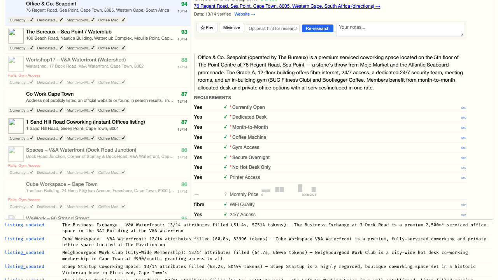
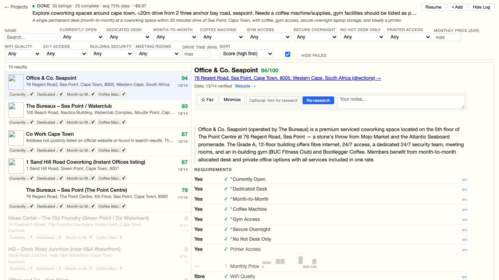
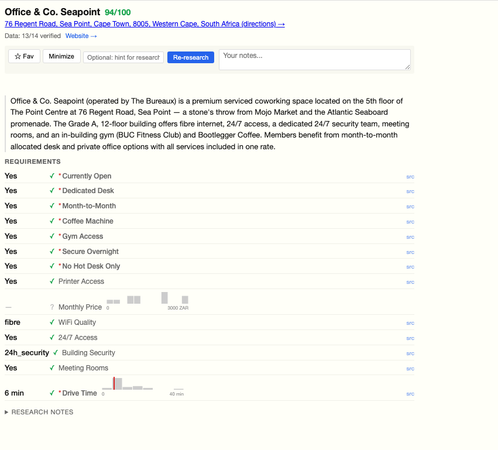

# Research Agent

A local tool for structured research. You give it a natural-language prompt like "find coworking spaces in Cape Town near Sea Point with a gym, coffee, and month-to-month contracts" and it:

1. Parses the prompt into hard/soft requirements with types and weights
2. Runs 5-10 parallel web searches to find candidates
3. Deduplicates with an LLM pass (same venue, different listing)
4. Deep-researches each candidate's official website, pricing pages, review sites
5. Fills in every requirement with a value, source URL, and explanatory note
6. Gets real drive times from Google Maps
7. Scores and ranks everything

All data goes into SQLite. The frontend is a dense, Tufte-inspired split view.



The left panel lists all found options with scores, key stats, and data completeness. The right panel shows the full breakdown for the selected listing -- each attribute has a value, a source link, and a tooltip with the LLM's reasoning. Numeric attributes get inline histograms showing where this listing falls relative to the others.



Filters are generated dynamically from the requirements. Bool filters default to "Yes + Unknown" (don't hide places just because data is missing). You can sort by any attribute, search by name, and hide listings that fail hard requirements.



Each attribute shows its value left-aligned for quick scanning, with the requirement label to the right. Hover a label to see the LLM's note explaining how it determined the value and where it found the data. Histogram bars show the distribution -- hover for counts and ranges.

## Getting started

You need Python 3.13+, Node 20+, and `uv`.

```
# Clone and set up
cd claude-research

# Backend
cd backend
uv sync
cd ..

# Frontend
cd frontend
npm install
cd ..

# API keys
cat > .env << 'EOF'
ANTHROPIC_API_KEY=sk-ant-...
GOOGLE_MAPS_API_KEY=...  # optional, for real drive times
EOF

# Build and run
./scripts/dev.sh
```

The server starts at `http://127.0.0.1:8000`. Type a research prompt and go.

If you want to skip Google Maps, that's fine -- Claude will estimate drive times instead (less accurate).

### Running tests

```
./scripts/check.sh
```

Runs ruff, pytest, tsc, eslint, and vitest in parallel. All checks must pass with zero warnings.

For E2E tests (needs the server running + Playwright installed):

```
cd frontend
npx playwright install chromium  # first time only
npx playwright test --config e2e/playwright.config.ts
```

### Verifying your API key

```
cd backend
uv run pytest tests/test_api_key.py -m api_key
```

## How it works

### Research pipeline

The engine runs five phases sequentially. Each phase uses independent Claude API calls (not one long conversation) so failures are isolated and phases can be parallelized internally.

**Parse** -- One Claude call extracts requirements from your prompt. Each requirement gets a machine key, short label, type (bool/int/float/text/enum), weight, and direction (higher/lower is better). Claude also infers requirements you didn't state explicitly (e.g. WiFi for coworking) and generates 5-10 search queries.

**Wide search** -- Each query runs as a separate Claude call with the `web_search` server tool. Up to 5 in parallel. Results are deduplicated first by URL domain similarity, then by an LLM pass that identifies same-venue duplicates across different listings.

**Deep research** -- Each unique listing gets its own Claude call with web search. Claude is instructed to visit the official website first (pricing pages, amenities, about), then supplement with review sites. For each attribute, it returns `{"value": ..., "source": "url", "note": "explanation"}`. Multi-tier values (e.g. different membership prices) are arrays.

**Distance enrichment** -- If `GOOGLE_MAPS_API_KEY` is set, drive times are calculated via the Distance Matrix API, replacing Claude's estimates with real data.

**Fallback resolution** -- For listings that pass hard requirements but are missing soft ones, Claude searches for nearby alternatives (e.g. "no coffee on-site, but a cafe 2 min walk away").

**Scoring** -- Deterministic weighted sum. Bool: 1 if true, 0 if false. Numeric: normalized across all listings. Unknown values don't cause hard requirement failure -- only explicit `false` does.

### Dynamic requirements

Requirements are defined at research time, not build time. The schema is stored in `project_requirements` and attribute values are JSON on each listing. Filtering uses `json_extract` with `COALESCE` to handle both plain values and structured `{"value": ..., "source": ...}` formats.

### Data model

```
projects
  -> project_requirements (dynamic schema per project)
  -> listings (attributes as JSON, scored)
       -> fallbacks (nearby alternatives)
  -> search_queries -> search_results
  -> llm_calls (token tracking)
  -> activity_log (persistent event log)
```

Everything is SQLite with a single shared connection (WAL mode, 5s busy timeout).

## Project structure

```
backend/
  app/
    main.py              FastAPI app, SPA routing
    config.py            Settings from .env
    database.py          SQLite schema, shared connection
    models.py            Dataclasses
    schemas.py           Pydantic request/response types
    api/
      projects.py        CRUD, SSE events, activity log
      listings.py        Filtering, distributions, retry, add
      requirements.py    Weight adjustment
      filters.py         Dynamic JSON->SQL query builder
    research/
      engine.py          Pipeline orchestrator
      parse.py           Prompt -> requirements + queries
      wide.py            Broad web search
      deep.py            Per-listing detailed research
      dedup.py           LLM-powered deduplication
      fallback.py        Nearby alternative search
      score.py           Deterministic scoring
      maps.py            Google Maps distance enrichment
      vision.py          OpenRouter image parsing (optional)
      prompts.py         All system prompts
      validate_urls.py   URL existence checking

frontend/
  src/
    components/          React components
    hooks/               useFilters (URL-synced), useProjectEvents (SSE + persisted)
    api/client.ts        Typed fetch wrapper
    types/index.ts       Shared types
    styles/index.css     Tufte-inspired dense layout

scripts/
  dev.sh                 Build frontend + start server
  check.sh               Parallel linting + testing
```

## Things to know

- Filter state and selected listing are stored in the URL. Copy the URL to share a specific view.
- You can favourite/minimize listings and add free-form notes. First line of notes shows in the sidebar.
- The activity log persists across page refreshes.
- "Resume" picks up where a previous run left off (skips completed phases).
- You can manually add a listing by URL (+ Add button) or retry failed ones with a hint.
- Cost is calculated at actual Sonnet rates ($3/M input, $15/M output).
- The `currently_open` requirement is always injected as a hard requirement.
- Drive time requirements are left to Google Maps when the API key is available.
